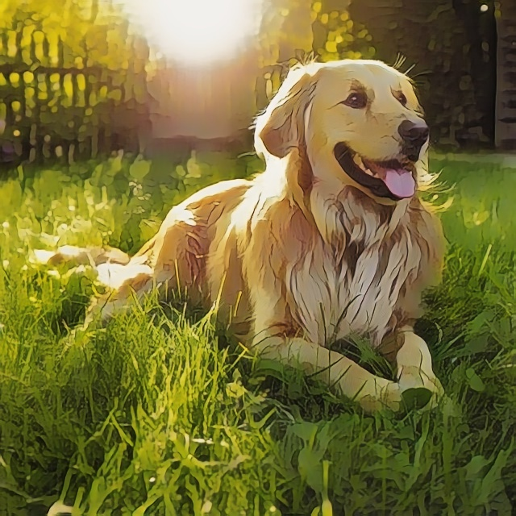

# Image Toonify with AI

Transform your photos into stunning cartoon and anime-style artwork using advanced AI models. Supports multiple styles (Hayao, Shinkai, CartoonGAN) with a seamless web experience.


---

## 🚀 Features

- Upload images and convert them to cartoon/anime styles
- Multiple AI models: Hayao, Shinkai, CartoonGAN
- User authentication & profile management
- Admin dashboard for image/user management
- Payment integration for premium features
- Responsive UI (EJS templates)

---

## 🖼️ Demo

Below is a side-by-side comparison of original uploaded images and their toonified versions:

| Original (Uploaded)                           | Processed (Toonified)                            |
| --------------------------------------------- | ------------------------------------------------ |
|  |  |
|  |  |
|  |  |
|  |  |
|  |  |

---

## ⚙️ Installation & Prerequisites

- Node.js
- Python 3.x
- pip

```bash
git clone https://github.com/krishna-ammu05/Image-Toonify-with-AI.git
npm install
pip install -r requirements.txt
npm start
```

> **Node + Python Interaction:**
> The Express server internally calls Python scripts for AI processing - no need to run them manually.

---

## 🔧 Configuration

Create a `.env` file in the root directory and add your environment variables as needed. Example:

```env
PORT=3000
MONGODB_URI=your_mongodb_uri
RAZORPAY_KEY=your_razorpay_key
RAZORPAY_SECRET=your_razorpay_secret
```

---

## 📁 Project Structure

```
app.js                # Main Express server
middleware.js         # Custom middleware
package.json          # Node.js dependencies
requirements.txt      # Python dependencies
ai_models/            # AI models and inference scripts
Init/                 # Initialization scripts
models/               # Mongoose models
public/               # Static assets (CSS, images)
Python/               # Image processing scripts
routes/               # Express routes
utils/                # Utility functions
views/                # EJS templates
```

---

## 📖 Usage

1. Register or log in to your account
2. Upload an image
3. Select a toonify style:
   - **Hayao**: Soft, watercolor anime effect
   - **Shinkai**: Vibrant, cinematic anime effect
   - **CartoonGAN**: Classic cartoon look
4. View and download the processed image

---

## 🧠 AI Model Notes

- Models are preloaded in the `ai_models/` directory.
- For best performance, ensure GPU support when running inference.
- Supported models:
  - **AnimeGANv3 (Hayao, Shinkai)**: ONNX format
  - **CartoonGAN**: PyTorch format

---

## 🛠️ Tech Stack

- **Backend:** Node.js (Express), Python
- **Database:** MongoDB (Mongoose)
- **Frontend:** EJS, CSS
- **AI Models:** AnimeGANv3, CartoonGAN (ONNX & PyTorch)

---

## 🤝 Contribution Guide

Contributions, issues, and feature requests are welcome! Please open an issue or submit a pull request.

---

## 📬 Contact

For questions or support, contact [Krishnaveni Ejjigiri](https://github.com/krishna-ammu05).
